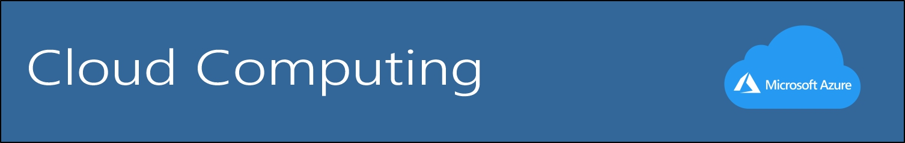

# Reto Master de la Semana 1

 En este repositorio se plantea diferentes conceptos aprendidos durante la **primera semana**

* El *Cloud Computing* o *Computación en la nube* es la entrega de servicios informáticos a través de Internet, lo que se conoce como la nube. Estos servicios incluyen servidores, almacenamiento, bases de datos, redes, software, análisis e inteligencia. 

Ejemplos:
* Microsoft Azure
* Huawei Cloud
* AWS
***
 

