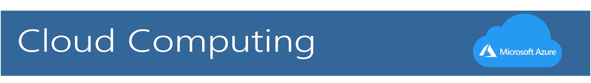
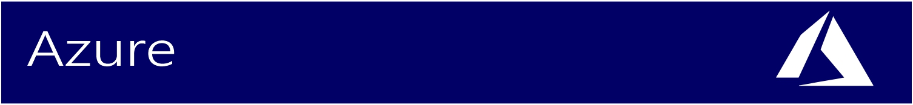

# Reto Master de la Semana 1

Conceptos aprendidos durante la **primera semana**
Autor: Jesús Ramseths Echeverría Rivera

### Índice

<Ul>
<li style="color: blue;">Cloud Computing</li>
<li style="color: blue;">Modelos de Servicio</li>
<li style="color: blue;">Azure</li>
<li style="color: blue;">Inteligencia Artificial</li>
<li style="color: blue;">DevOps</li>
<li style="color: blue;">IoT</li>
<li style="color: blue;">Machine Learning</li>
<li style="color: blue;">Big Data</li>
<li style="color: blue;">Kubernetes</li>
<li style="color: blue;">API</li>
</Ul>

* El *Cloud Computing* o *Computación en la nube* es la entrega de servicios informáticos a través de Internet, lo que se conoce como la nube. Estos servicios incluyen servidores, almacenamiento, bases de datos, redes, software, análisis e inteligencia. 

Ejemplos:
* Microsoft Azure
* Huawei Cloud
* AWS

***

* Estos modelos definen los diferentes niveles de responsabilidad compartida de un proveedor de nube y un cliente en la nube. Existen tres diferentes modelos:

#### IaaS (Infraestructura como servicio)
* ***IaaS*** se reduce y escala verticalmente en función de la demanda, lo que le permite pagar solo por lo que usa. 

#### PaaS (Plataforma como servicio)
* Al igual que IaaS, ***PaaS*** incluye infraestructura (servidores, almacenamiento y redes), pero también incluye middleware, herramientas de desarrollo, servicios de inteligencia empresarial (BI), sistemas de administración de bases de datos, etc. 

#### SaaS (Software como servicio)
* ***SaaS*** ofrece una solución de software integral que se adquiere de un proveedor de servicios en la nube mediante un modelo de pago por uso. Usted alquila el uso de una aplicación para su organización y los usuarios se conectan a ella a través de Internet, normalmente con un explorador web. 

***

* Es un conjunto de servicios en la *nube* en expansión constante que *ayudan a la organización a cumplir los desafíos empresariales actuales y futuros*. Azure le ofrece la libertad de **compilar, administrar e implementar** aplicaciones en una red global masiva mediante sus herramientas y plataformas favoritas.

<a href="https://azure.microsoft.com/es-es/overview/what-is-azure/">¿Deseas saber más? Haz clic aquí :)</a>

***

* Es la capacidad de un sistema informático de imitar funciones cognitivas humanas, como el aprendizaje y la solución de problemas.

* Mediante el uso de las matemáticas y la lógica, un sistema informático simula el razonamiento que siguen las personas para aprender a partir de información nueva y tomar decisiones.

***

* Es una combinación de los términos ingleses *development (desarrollo)* y *operations (operaciones)*, designa la unión de **personas, procesos y tecnología** para ofrecer valor a los clientes de forma constante.
* *¿Qué significa DevOps para los equipos?* DevOps permite que los roles que antes estaban aislados (desarrollo, operaciones de TI, ingeniería de la calidad y seguridad) se coordinen y colaboren para crear productos mejores y más confiables.

***

* La internet de las cosas (IoT, por sus siglas en inglés) es un sistema de dispositivos de computación interrelacionados, máquinas mecánicas y digitales, objetos, animales o personas que tienen identificadores únicos y la capacidad de transferir datos a través de una red, sin requerir de interacciones humano a humano o humano a computadora.

***

* El *Machine Learning o Aprendizaje Automático* es una rama dentro del campo de la *Inteligencia Artificial* cuyo objetivo es dotar a los ordenadores de la capacidad de **aprender** sin necesidad de ser programados.

* El término se lleva utilizando desde los 50, pero ha sido en los últimos años cuando ha tomado gran relevancia gracias al aumento de la *capacidad de computación*, así como al gran volumen de datos que las empresas tienen que manejar.

Tipos de Aprendizaje:
* Aprendizaje Supervisado
* Aprendizaje No Supervisado
* Aprendizaje por Refuerzo

***

* Son el conjunto de tecnologías que han sido creadas para **recopilar, analizar y gestionar los datos** que generan los usuarios de Internet. Su idea es la de recopilar los datos masivos que son generados en "bruto", y procesarlos para *identificar patrones u otro tipo de comportamientos* que puedan ayudar a sectores concretos.
* El Big Data no se refiere únicamente a los datos que se generan al navegar por Internet. También son los datos crudos que generan los usuarios de diferentes aplicaciones o servicios. Por lo tanto, cada empresa de servicios puede tener ingentes cantidades de datos generados por los usuarios, y usarán las herramientas de Big Data para poder analizarlos y procesarlos intentando beneficiarse de ellos.

***

* Las *aplicaciones modernas* se basan cada vez en el uso de contenedores, que son microservicios empaquetados con sus dependencias y configuraciones. **Kubernetes** es un software de código abierto para implementar y administrar esos contenedores a gran escala, y también es la palabra griega para timonel de un buque o piloto. Cree, entregue y escale aplicaciones en contenedores con más rapidez usando Kubernetes, que a veces se denomina “k8s”.

***

* El término *API* es una abreviatura de **Application Programming Interfaces**, que en español significa *interfaz de programación de aplicaciones*. Se trata de un conjunto de definiciones y protocolos que se utiliza para desarrollar e integrar el software de las aplicaciones, permitiendo la comunicación entre dos aplicaciones de software a través de un conjunto de reglas.

*  Podemos hablar de una API como una especificación formal que establece **cómo un módulo de un software se comunica o interactúa con otro** para cumplir una o muchas funciones.

*** 
